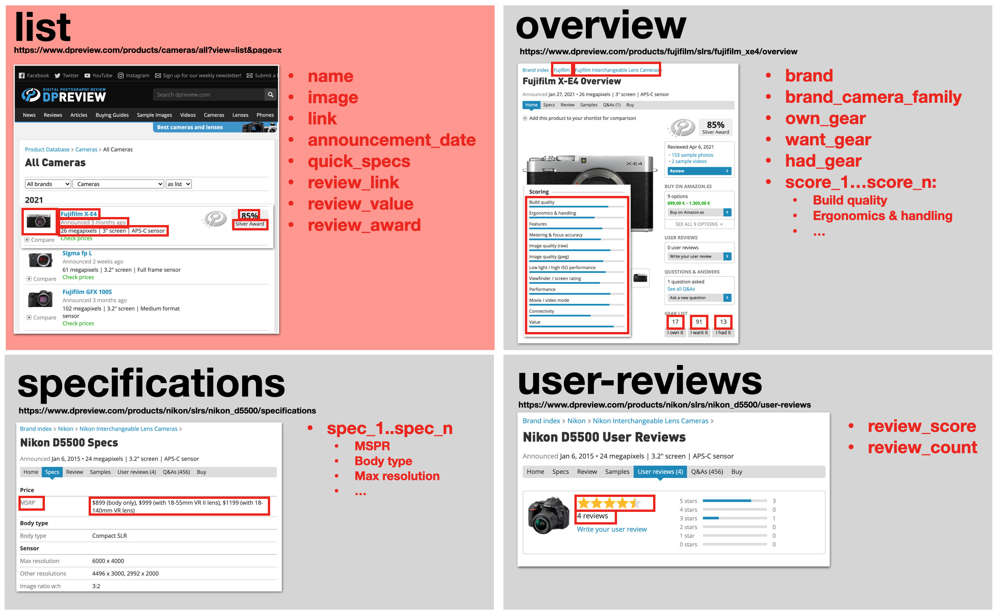
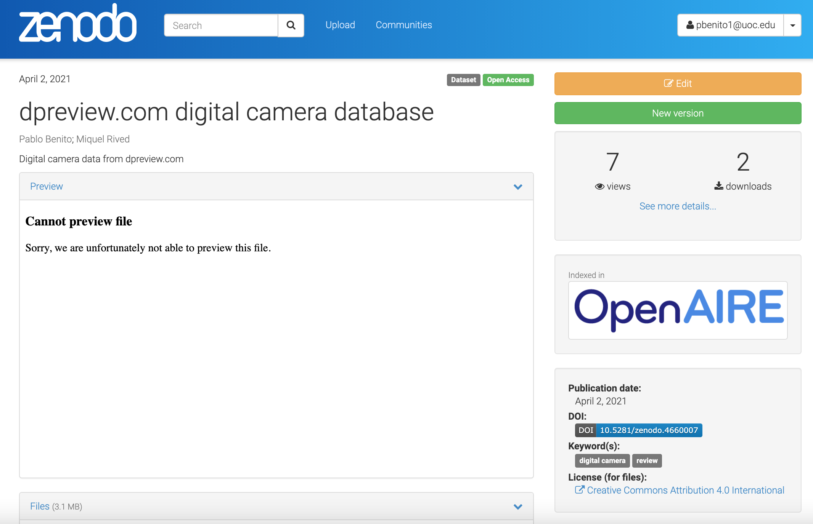

# dpreview.com scraping
Scraper de datos sobre cámaras digitales de dpreview.com

Práctica 1 de la asignatura *"Tipología y ciclo de vida de los datos"* del [Máster en Ciencia de Datos de la UOC](https://estudios.uoc.edu/es/masters-universitarios/data-science/presentacion)

# Autores

* Pablo Benito
* Miquel Rived 

# Contexto
Esta práctica se ha realizado bajo el contexto de la asignatura Tipología y ciclo de vida de los datos, perteneciente al Máster en Ciencia de Datos de la Universitat Oberta de Catalunya. En ella, se aplican técnicas de web scraping mediante el lenguaje de programación Python para extraer así datos de la web dpreview.com y generar un dataset.

Digital Photography Review (dpreview.com) es un sitio web sobre cámaras digitales y fotografía digital en el que se pueden encontrar análisis de cámaras digitales, guías de compra, opiniones de usuarios y foros muy activos. Es uno de los 1.500 sitios web más visitados en Internet, además de ser actualmente el sitio de fotografía difital con mayor audiencia. 

Además de lo comentado, lo que ha hecho decantarse por esta dirección para realizar el web scrapping es su amplia base de datos con información sobre cámaras dígitales.

# Definir un título para el dataset
Características y evaluación de cámaras fotográficas digitales

# Descripción del dataset
El `dataset` obtenido mediante el scraper contiene los datos de la base de datos de cámaras digitales recopiladas por [dpreview.com](dpreview.com).

El dataset contiene tanto características de las propias cámaras, como de valoración otorgada por los expertos de la propia página y de los usuarios de su comunidad.

# Representación gráfica

TODO: Presentar esquema o diagrama que identifique el dataset visualmente y el proyecto elegido

# Contenido

Se podrían separar los campos extraídos en dos áreas, la primera correspondiente a las características de la cámara y la segunda referente a las valoraciones.

En cuanto a las características de las cámaras se ha extraído una gran cantidad de campos, destacando el nombre de la cámara, la marca, el precio, los píxeles del sensor, la máxima resolución o el tamaño de la pantalla.

Por lo que a la valoración de los expertos se refiere, se ha recogido una valoración del 0 al 100 referente a la calidad de construcción, ergonomía y manejo, características, precisión de medición y enfoque, calidad de imagen (raw), calidad de imagen (jpeg), rendimiento con poca luz, valoración del visor, modo de vídeo, conectividad y el valor, además de la media de la valoración de los usuarios.

# Agradecimientos

**dpreview.com** es el sitio web de referencia en lo que a cámaras fotográficas digitales se refiere.

Lleva activo desde 1999 y cuenta con una gran comunidad de usuarios muy activos, sus reviews destacan por su calidad, incorporando muestras fotográficas de un gran número de cámaras digitales.

En el análisis hecho por [fongfan999](https://github.com/fongfan999/dpreview_analyzer) se estudiaron las reseñas en Amazon desde Dpreview.com.

Por otro lado, en el análisis  realizado por [nmounika](https://github.com/nmounika/dpreview_webscrape/blob/master/camera%20webscrape%20dpreview.py) se analizaron las especificaciones de distintas cámaras.

# Inspiración

Lo más interesante del conjunto de datos extraído es la gran cantidad de especificaciones diferentes que se encuentran, así como el gran abanico de cámaras digitales que lo abarcan.

En primer lugar se quiere ver que especificaciones afectan más en el aumento de precio de una cámara digital.

Por otro lado, se quiere ver que cámaras son las más valoradas por los usuarios o los expertos, por lo que se pretenderá analizar las marcas más valoradas, si el precio influye en la valoración final, o que tipo de especificaciones son las que buscan los usuarios en una cámara digital para realizar una valoración alta.

# Licencia
TODO: Seleccione una de estas licencias para su dataset y explique el motivo
de su selección:
- Released Under CC0: Public Domain License
- Released Under CC BY-NC-SA 4.0 License
- Released Under CC BY-SA 4.0 License
- Database released under Open Database License, individual contents
under Database Contents License
- Other (specified above)
- Unknown License

La licencia escogida para la publicación del dataset es Released Under CC BY-SA 4.0 ya que por los motivoss que se listan a continuación relacionados con sus cláusulas se cree que es la más idónea:
- En primer lugar, el hecho de tener que proveer el nombre del creador del conjunto de datos junto con los cambios realizados hace que se valore el trabajo de dpreview.com a la par que se exponen las aportaciones realizadas por nosotros en la extracción.
- Al permitirse su uso comercial hace que se puedan realizar trabajos a partir del dataset que nos reporten cierto reconocimiento.
- Toda contribución realizada a posteriori deberá distribuirse bajo la misma licencia, por lo que todo trabajo realizado sobre el que se está haciendo deberá seguir distribuyéndose bajo los términos planteados.
# Código

El scraper se ha desarrollado en Python utilizando las librerías `requests` y `beautifulsoup`. 

El script se puede consultar 
[aquí](app.py)

# Dataset
El dataset se encuentra publicado en Zenodo en el siguiente repositorio: https://zenodo.org/record/4660007

A continuación se muestra una captura del registro del dataset en Zenodo:

# 
